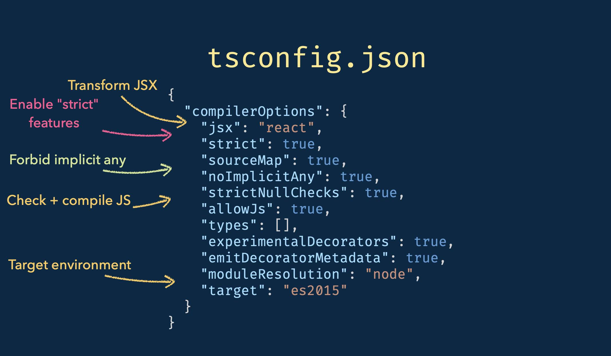
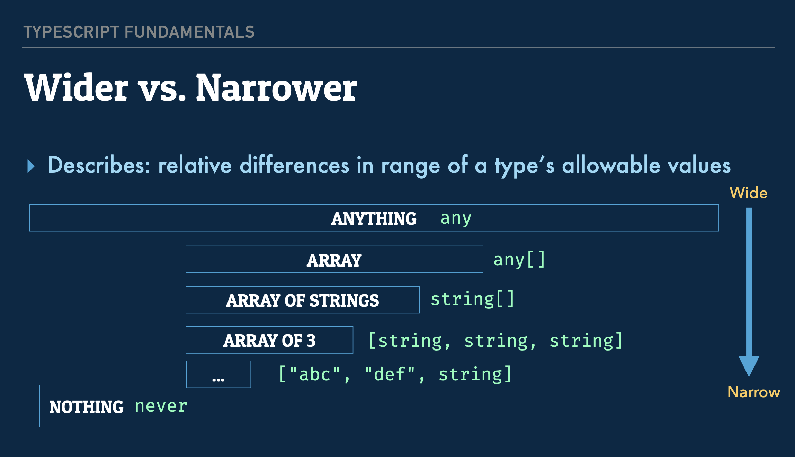

&nbsp;
<div align=center>
  
</div>
&nbsp;

<h1>TypeScript 3 Fundamentals, v2</h1>

- [1. TypeScript Basics](#1-typescript-basics)
  - [1.1. Variables](#11-variables)
  - [1.2. Variable Declarations](#12-variable-declarations)
  - [1.3. Arrays \& Tuples](#13-arrays--tuples)
  - [1.4. Object Types \& Interfaces](#14-object-types--interfaces)
  - [1.5. Intersection \& Union Types](#15-intersection--union-types)
  - [1.6. Type Systems \& Object Shapes](#16-type-systems--object-shapes)
  - [1.7. Functions](#17-functions)
  - [1.8. Function Signature Overloading](#18-function-signature-overloading)
  - [1.9. Lexical Scope](#19-lexical-scope)
- [2. Interfaces \& Type Aliases](#2-interfaces--type-aliases)
  - [2.1. Type Aliases \& Extends](#21-type-aliases--extends)
  - [2.2. Call \& Construct Signatures](#22-call--construct-signatures)
  - [2.3. Dictionary Objects \& Index Signatures](#23-dictionary-objects--index-signatures)
  - [2.4. Combining Interfaces](#24-combining-interfaces)
  - [2.5. Type Aliases vs Interfaces](#25-type-aliases-vs-interfaces)
  - [2.6. Type Tests](#26-type-tests)
- [3. Classes](#3-classes)
  - [3.1. Access Modifiers \& Initialization](#31-access-modifiers--initialization)
    - [3.1.1. Definite Assignment \& Lazy Initialization](#311-definite-assignment--lazy-initialization)
  - [3.2. Abstract Classes](#32-abstract-classes)
- [4. Converting to TypeScript](#4-converting-to-typescript)
  - [4.1. What not to do](#41-what-not-to-do)
  - [4.2. Step 1: Compiling in "Loose Mode"](#42-step-1-compiling-in-loose-mode)
  - [4.3. Step 2: Explicit Any](#43-step-2-explicit-any)
  - [4.4. Step 3: Squash Explicit anys, Enable Strict Mode](#44-step-3-squash-explicit-anys-enable-strict-mode)
- [5. Generics](#5-generics)
  - [5.1. Type Parameters](#51-type-parameters)
  - [5.2. Constraints \& Scope](#52-constraints--scope)
  - [5.3. Use Cases](#53-use-cases)
- [6. Top \& Bottom Types](#6-top--bottom-types)
  - [6.1. Top Types](#61-top-types)
  - [6.2. Type Guards](#62-type-guards)
  - [6.3. Unknowns \& Branded Types](#63-unknowns--branded-types)
  - [6.4. Bottom Types](#64-bottom-types)
- [7. Advanced Types](#7-advanced-types)
  - [7.1. Mapped Types](#71-mapped-types)
  - [7.2. Type Queries](#72-type-queries)
  - [7.3. Conditional Types](#73-conditional-types)
  - [7.4. Built-in Utility Types](#74-built-in-utility-types)
- [8. Declaration Merging](#8-declaration-merging)
  - [8.1. Functions \& Variables](#81-functions--variables)
  - [8.2. Interfaces](#82-interfaces)
  - [8.3. Classes](#83-classes)
- [9. Compiler API](#9-compiler-api)
  - [9.1. Initializing](#91-initializing)
  - [9.2. Type Checker](#92-type-checker)

## Introducion

### 0.1. What's TypeScript?

- An open-source typed, syntactic superset of JavaScript, developed
by Microsoft
- Compiles to readable JavaScript▸ Comes in three parts: Language, Language Server and Compiler
- Works seamlessly with Babel 7

### 0.2. Why add types?

- Encode constraints and assumptions, as part of developer intent
- Catch common mistakes (i.e. incomplete refactors)
- Move some runtime errors to compile time
- Provide your consumers (including you) with a great DX

### 0.3. In this class, we'll learn about ...

- Adding type information to variables, functions and classes
- Configuring the compiler▸ A practical strategy for incrementally converting JS to TS
- Parameterizing interfaces and type aliases with generics
- Conditional, mapped and branded types
TS Compiler API basics

### 0.4. Compiling

Running `tsc src/index.ts` will output a JavaScript file compiled from the TypeScript we write. 

The output JavaScript is ES3, compatible as far back as IE6. 

This is the default behaviour - JS that can run basically anywhere. 

### 0.5. Flags

We can add different flags to change the compiler behaviour. 

- The target flag lets us specify a JS version: `tsc src/index.ts --target ES2015`
- The module flag lets us specify module resolution for example nodeJS commonJS: `tsc src/index.ts --module commonjs`
- The watch flag allows for compiling incrementally on save only the code that is changed: `tsc src/index.ts --watch`

### 0.6. Configuration

The commands get big and cumbersome, so the conventional method is to use a config file instead.

Two things to think about when defining the config:

1. What files are the inputs. 
    - Use the file or include array which accepts globs.
2. The compiler options.

For the equivalent of what we defined before the config would be:

```json
{
  "compilerOptions": {
    "module": "commonjs",
    "target": "es2017",
    "outDir": "lib"
  },
  "include": ["src"]
}
```

Now if we run `tsc` the output will be in the lib directory. 

This way we can publish our lib file to npm, and push our src directory to GitHub. This keeps things nicely organized. The only problem is we have a lot of type information that is missing from the output. What if we have TypeScript users that could make good use of this information? 

We need to add declaration & soureMap options.

```json
{
  "compilerOptions": {
    "module": "commonjs",
    "target": "es2017",
    "outDir": "lib",
    "declaration": true,
    "sourceMap": true
  },
  "include": ["src"]
}
```

Now if we run `tsc` we see two new files: index.d.ts & index.js.map.

- index.d.ts is a type representation file that is supposed to layer on top of JavaScript. A TypeScript aware editor like VSCode will understand this file and match it with the JavaScript.
- index.js.map is what allows us to use debugger, to map the JS to the TS source. So it gives the impression we are debugging TS code but in fact what is running is the JS.

An example of a more complicated config:


## 1. TypeScript Basics

### 1.1. Variables

`let x = "hello world";` declares `x` as a `string` which is known as inference. We don't need to type every single thing, and in fact doing so makes a program very rigid. 

Just like any `let` declaration we can reassign it with no problem. `x = "hello mars";`

But if we try and reassign a different type, we get an error. 

```tsx
x = 42; // 🚨 ERROR Type 'number' is not assignable to type 'string'
```

If we do the same with `const` we get a different situation. `const y = "hello world";`

This is called a 'string literal type'*.* `y` can never be reassigned since it's a `const`, so we can regard it as only ever holding a value that's literally the string 'hello world' and no other possible value.

### 1.2. Variable Declarations

Sometimes we need to declare a variable without initializing it.

```tsx
let z;
z = 41;
z = "abc"; // no error, oh no! This isn't good
```

In this situation `z` takes on a type of `any`, known as a **top type** meaning it can take any value.

This is the default behaviour of JS. 

There are some places where `any` is acceptable, but in general it shows weakness in our types.

We could improve this situation by providing a **type annotation** when we declare our variable.

```tsx
let zz: number;
zz = 41;
zz = "abc"; // 🚨 ERROR Type '"abc"' is not assignable to type 'number'.
```


> ℹ️ If we have declarations where we don't initialize the variable, we should always provide a type annotation.


### 1.3. Arrays & Tuples

TypeScript will default `let aa = []` to an array of type never, which is TS' **bottom type**. 

So for array declarations that start as empty, we must be specific about what type we want them to contain. With even one element TS will be able to infer. A good case to initialize arrays with values.  

```tsx
let aa: number[] = [];
aa.push(33);
aa.push("abc"); // 🚨 ERROR: Argument of type '"abc"' is not assignable to parameter of type 'number'.
```

We can define a tuple which has a fixed length. 

```tsx
let bb: [number, string, string, number] = [
  123,
  "Fake Street",
  "Nowhere, USA",
  10110
];

bb = [1, 2, 3]; // 🚨 ERROR: Type 'number' is not assignable to type 'string'.
```

**🚨 We don't get type safety with `array.push()`**

### 1.4. Object Types & Interfaces

Object types can be expressed using `{}` and property names.

The look like values, apart from the `;` which helps differentiate. 

```tsx
let cc: { houseNumber: number; streetName: string };

cc = {
  streetName: "Fake Street",
  houseNumber: 123
};
```

By default all properties are mandatory. To make a property optional use `?`

```tsx
let dd: { houseNumber: number; streetName?: string };

dd = {
  houseNumber: 33
};
```

Interfaces are structures for reusable types. We can import and export them just like modules. 

```tsx
interface Address {
  houseNumber: number;
  streetName?: string;
}

// and refer to it by name
let ee: Address = { houseNumber: 33 };
```

### 1.5. Intersection & Union Types

Sometimes we have a type that can be one of several things.

The equivalent of `||` and `&&` in the type world. 

Here `name` is the intersection between the two interfaces. Like the intersection of a Venn diagram.

```tsx
export interface HasPhoneNumber {
  name: string;
  phone: number;
}

export interface HasEmail {
  name: string;
  email: string;
}

let contactInfo: HasEmail | HasPhoneNumber =
  Math.random() > 0.5
    ? {
        // we can assign it to a HasPhoneNumber
        name: "Mike",
        phone: 3215551212
      }
    : {
        // or a HasEmail
        name: "Mike",
        email: "mike@example.com"
      };

contactInfo.name; 
// NOTE: we can only access the .name property 
// (the stuff HasPhoneNumber and HasEmail have in common) 
```

Union types use the `&` operator.  Like the entire Venn diagram.

```tsx
let otherContactInfo: HasEmail & HasPhoneNumber = {
  // we _must_ initialize it to a shape that's asssignable to HasEmail _and_ HasPhoneNumber
  name: "Mike",
  email: "mike@example.com",
  phone: 3215551212
};

otherContactInfo.name; // NOTE: we can access anything on _either_ type
otherContactInfo.email;
otherContactInfo.phone;
const zzz: any = {} as never;
```

### 1.6. Type Systems & Object Shapes

Type systems come down to the question of equivalence. 

When we look at the left and right hand of an assignment, TS is really asking: is the type of the value equivalent to the type of the variable being assigned to? 

The same thing happens when an argument is being passed to a function.

Nominal Type Systems answer this question based on whether x is an instance of a class/type named HTMLInputElement.

Structural Type Systems only care about the shape of an object - This is how TypeScript works!

When we talk about the shape of an object, we're referring to the names of properties and types of their values.

If we have consistent shapes in JS and avoid adding properties to objects that are heavily used, we have more change of runtime engines like V8 optimizing our code. 

TypeScript uses the terms wider and narrower to define levels of specificity. 

The widest type is any, and allows for any possible value, almost infinity. 

An array would be a of narrower type. We can go on to narrow things further. 

`never` is infinitely narrow as in a variable cannot hold any value, ever.



### 1.7. Functions

We should always use type annotations with functions, because we want to define the contact the function has with other parts of our program. 

```tsx
function sendEmail(to: HasEmail): { recipient: string; body: string } {
  return {
    recipient: `${to.name} <${to.email}>`, // Mike <mike@example.com>
    body: "You're pre-qualified for a loan!",
  };
}
```

This can also be written as an arrow function.

```tsx
const sendTextMessage = (
  to: HasPhoneNumber
): { recipient: string; body: string } => {
  return {
    recipient: `${to.name} <${to.phone}>`,
    body: "You're pre-qualified for a loan!"
  };
};
```

When we type function arguments we should type the minimum thing we need to avoid over-constraining the function. Types may be useful elsewhere: we don't want to artificially impose constraints on what the arguments must be.

Return types can be inferred for functions. But it is best to always specify a return type because it keeps us honest in all branches of the function to ensure what we return is intentional. 

Rest params work just as you'd think. Type must be array-ish

```tsx
const sum = (...vals: number[]) => vals.reduce((sum, x) => sum + x, 0);
console.log(sum(3, 4, 6)); // 13
```

### 1.8. Function Signature Overloading

Take this example of a function where the `method` can be either `"email"` or `"phone"`

```tsx
// implementation
function contactPeople(
  method: "email" | "phone",
  ...people: (HasEmail | HasPhoneNumber)[]
): void {
  if (method === "email") {
    (people as HasEmail[]).forEach(sendEmail);
  } else {
    (people as HasPhoneNumber[]).forEach(sendTextMessage);
  }
}
```

Mixing the types in a function invocation should cause an error, but it doesn't. 

```tsx
// ✅ email works
contactPeople("email", { name: "foo", email: "" });

// ✅ phone works
contactPeople("phone", { name: "foo", phone: 12345678 });

// 🚨 mixing does not work
contactPeople("email", { name: "foo", phone: 12345678 });
```

This is because we have defined two independent and unrelated constraints. The `method` can be either `"email"` or `"phone"` and the `people` can be a mixture of `HasEmail` and `HasPhoneNumber`. 

Although these are the narrowest types we could provide for the two arguments, there is some disallowed combination that we want to prevent. 

TypeScript provides a solution called **overload signatures**. 

```tsx
function contactPeople(method: "email", ...people: HasEmail[]): void;
function contactPeople(method: "phone", ...people: HasPhoneNumber[]): void;
```

These are specific, valid ways to access this function. 

Now the error is thrown as expected. 

The implementation is not callable from the outside. It just needs to be wide enough to accommodate all of the function signatures. 

We can allow certain styles of invocation and forbid anything else. 

We can only have multiple function heads, not implementations, since the code still needs to compile to JavaScript. 

### 1.9. Lexical Scope

`this` is actually part of a function signature. If we define a function that relies on `this` (outside of a class since classes handle `this` by themselves) we need the value of `this` to be correct. 

We only need to put `this` in the very beginning, like a pseudo-parameter, for type checking to be handled.

```tsx
function sendMessage(
  this: HasEmail & HasPhoneNumber,
  preferredMethod: "phone" | "email"
) {
  if (preferredMethod === "email") {
    console.log("sendEmail");
    sendEmail(this);
  } else {
    console.log("sendTextMessage");
    sendTextMessage(this);
  }
}

```

We create an object that matches the required input, and a function that invokes a callback, with `null` being intentionally defined as the lexical scope. 

```tsx
const c = { name: "Mike", phone: 3215551212, email: "mike@example.com" };

function invokeSoon(cb: () => any, timeout: number) {
  setTimeout(() => cb.call(null), timeout);
}
```

If we omit the object which `this` refers to and the function expects, we get a type error because the `this` constraint is not satisfied. 

```tsx
// 🚨 this is not satisfied
invokeSoon(() => sendMessage("email"), 500);
```

It we satisfy the `this` constraint as required, we get no error. 

We can solve this in two ways: 

1. We could bind the function, thereby creating a closure around the function and ensuring it is invoked with the correct lexical scope. 

```tsx
// ✅ creating a bound function is one solution
const bound = sendMessage.bind(c, "email");
invokeSoon(() => bound(), 500);
```

2. Use `call` or `apply`.  We can enable strict type checking with `bind`, `call` and `apply`.

```tsx
// ✅ call/apply works as well
invokeSoon(() => sendMessage.apply(c, ["phone"]), 500);
```

> ℹ️ Note that although this appears like an additional argument, it is not. The function accepts one parameter still.

## 2. Interfaces & Type Aliases

Both are ways of giving a structure and name that we can refer to and export & import like modules. We can have one central place where a type is defined which can be used throughout a codebase. 

### 2.1. Type Aliases & Extends

A really simple concept which literally means we give a name to a type. 

```tsx
type StringOrNumber = string | number;
```

Any type that can be assigned to a variable can be given a type alias. This is not true for interfaces. A type alias is more flexible than an interface in that sense. 

The only time we will see a type on the right hand side of an assignment:

```tsx
type HasName = { name: string };
```

This is purely in type-land, and would compile to no JavaScript at all. 

One of the challenges with type aliases was that they are defined and figured out by the TypeScript compiler inline as the file is parsed (in terms of what values are allowed) which prevented us from creating self-referential types. 

```tsx
type NumVal = 1 | 2 | 3 | NumArr;
type NumArr = NumVal[];

```

This used to throw an error, but has been corrected since TS v3.7

Interfaces can extend from other interfaces. 

```tsx
export interface HasInternationalPhoneNumber extends HasPhoneNumber {
  countryCode: string;
}
```

### 2.2. Call & Construct Signatures

Interfaces can describe objects, functions, arrays... we are dealing exclusively with JS values that extend from the JS object type. 

We will never see an interface handle primitive types, or operators used with types like `string` or `number`. There is no way to describe that with an interface. Interfaces can only describe things that have a prototype. 

Type aliases are able to handle everything including everything that an interface can. 

We can use an interface to describe a call signature. 

```tsx
interface ContactMessenger1 {
  (contact: HasEmail | HasPhoneNumber, message: string): void;
}
```

And we can do the same with a type alias. 

```tsx
type ContactMessenger2 = (
  contact: HasEmail | HasPhoneNumber,
  message: string
) => void;
```

One cool thing about function types is that we get **contextual inference**. The types for the arguments are inferred from the interface definition of `ContactMessenger1`. 

```tsx
const emailer: ContactMessenger1 = (_contact, _message) => {
  /** ... */
};
```

The same benefit is true for callbacks. At every call site that a callback is passed along to does not require type info to be redefined. 

Construct signatures look very similar to call signatures. They just need the `new` keyword. 

```tsx
interface ContactConstructor {
  new (...args: any[]): HasEmail | HasPhoneNumber;
}
```

### 2.3. Dictionary Objects & Index Signatures

A dictionary is just a key / value data structure like array or object in JS. 

We are saying when this dictionary is queried with a string, it will either have no value at all, or the form defined. 

```tsx
interface PhoneNumberDict {
  // arr[0],  foo['myProp']
  [numberName: string]:
    | undefined
    | {
        areaCode: number;
        num: number;
      };
}

const phoneDict: PhoneNumberDict = {
  office: { areaCode: 321, num: 5551212 },
  home: { areaCode: 321, num: 5550010 } // try editing me
};
```

We need to be careful to not type dictionary types in a way that TS gives us a false guarantee, that no matter what property value we pass in we will get a well defined value out. If we omit the `undefined` type:

```tsx
interface PhoneNumberDict {
  [numberName: string]: {
      areaCode: number;
      num: number;
    };
}

const d: PhoneNumberDict = {}

d.abd // No error given! 
```

This is a hard to track error waiting to happen. By adding `undefined` we force a check. 

```tsx
interface PhoneNumberDict {
  [numberName: string]:
    | undefined
    | {
        areaCode: number;
        num: number;
      };
}

const d: PhoneNumberDict = {}

if (d.abc) { // here the undefined type appears in the tooltip
    d.abc // here no undefined type appears
}
```

What we have done here is narrowed the type. 

TS understands that `undefined` can never be a truthy value, so there is no way for anything with a value of type `undefined`  to pass the condition and get into the block . 

And this is the proper use that we would want anyway. If we are handed something and told it is a certain type, we don't really know what's there. 

> So conditions can be used to narrow types.

Note we can only at most have one string index signature and one number index signature. 

### 2.4. Combining Interfaces

We can use index signatures in combination with other types. Here we are declaring an interface with the same name as before. 

```tsx
interface PhoneNumberDict {
  home: {
    /**
     * interfaces are "open", meaning any declarations of the
     * same name are merged
     */
    areaCode: number;
    num: number;
  };
  office: {
    areaCode: number;
    num: number;
  };
}
```

We have added new required properties. Everyone must have a home and an office phone number. And the index signature still exists underneath all of that. 

```tsx
phoneDict.home;   // definitely present
phoneDict.office; // definitely present
phoneDict.mobile; // MAYBE present (has | undefined type in tooltip)
```

And index signature would be a way to facilitate typing an object where some properties are sure to be present but there can be more properties optionally present. 

What we are observing is declaration merging and that we can stack indexes on top of other things. 

### 2.5. Type Aliases vs Interfaces

Interfaces are parsed like functions in that they are hoisted, but it isn't until we access and use an interface that we figure out what  the allowable types are. 

 Although type aliases are initialized synchronously, they can reference themselves.

```tsx
type NumberVal = 1 | 2 | 3 | NumberVal[];
```

Interfaces are initialized lazily, so combining it with a type alias allows for recursive types.

```tsx
type StringVal = "a" | "b" | "c" | StringArr;

interface StringArr {
  [k: number]: "a" | "b" | "c" | StringVal[];
}
```

We want to use interfaces for anything that are a subtype of an object in a JS sense, so objects, arrays, functions i.e. everything apart from primitive values. 

Unlike an interface declaration, a type alias declaration can introduce a name for any kind of type, including primitive, union, and intersection types. Type aliases are as such extremely flexible, and can be used for everything. Anything we can use as a type of a variable fits in a type alias.

So we could define object types with type aliases, however by doing so we lose some benefits.

- An **interface** can be named in an extends or implements clause, but a **type** alias for an object **type** literal cannot.
- An **interface** can have multiple merged declarations, but a **type** alias for an object **type** literal cannot.

### 2.6. Type Tests

MS has a library [https://github.com/Microsoft/dtslint](https://github.com/Microsoft/dtslint) for writing tests for types. 

It parses linting error messages and compares them against special comments we leave in our types.

This can be useful if we have some really gnarly code that we want more confidence with.

## 3. Classes

TypeScript introduces two main things on top of JS classes:

1. Fields
2. Access modifier keywords (public, private, protected) which allow us to control who can see member data & member functions on instances. 

Classes work similarly to what you're used to seeing in JS. They can "implement" interfaces.

```tsx
export class Contact implements HasEmail {
  email: string;
  name: string;
  constructor(name: string, email: string) {
    this.email = email;
    this.name = name;
  }
}
```

For any class that implements this interface we must ensure the properties are stated and available upfront. 

We are declaring first that these member data fields will exist. 

```tsx
  email: string;
  name: string;
```

Then we are stating that we accept two parameters and we ensuring that we pass the arguments our constructor receives onto the instance which is of course `this` within the constructor. 

```tsx
  constructor(name: string, email: string) {
    this.email = email;
    this.name = name;
  }
```

### 3.1. Access Modifiers & Initialization

This looks a little verbose. We have to specify the words "name" and "email" 3x.

TypeScript has a shortcut: **parameter properties**. But to understand that we first need to understand access modifiers.

Access modifiers are keywords which define who can access something. 

1. `public` - everyone
2. `protected` - me and subclasses
3. `private` - only me

Through adding an access modifier keyword before our constructor's arguments we can create the exact equivalent of what we had before. 

```tsx
/*
export class Contact implements HasEmail {
  email: string;
  name: string;
  constructor(name: string, email: string) {
    this.email = email;
    this.name = name;
  }
}
*/ 

class ParamPropContact implements HasEmail {
  constructor(
      public name: string, 
      public email: string
      ) {
    // nothing needed
  }
}
```

If we were to use `protected` we would still be able to see the argument, but would not be able to access it from the outside. 

We also get an error from TS in our scenario since we are no longer conforming to the interface `HasEmail` since we cannot access both properties. 

Note that parameter properties can have initializers (defaults).

```tsx
class OtherContact implements HasEmail, HasPhoneNumber {
  protected age: number = 0;
  private password: string = "no email" // default value
  constructor(
		public name: string, 
		public email: string, 
		public phone: number
		) {
    // ...
  }
}
```

There is also `readonly` which will cause TS to error when trying to assign a value. But be careful because this does nothing at all in terms of preventing rights to this value. It is just a type checking tool.

#### 3.1.1. Definite Assignment & Lazy Initialization

We can provide an initializer by other means as below. If we don't initialize the declared parameter `password` TS will error. 

```tsx
class OtherContact implements HasEmail, HasPhoneNumber {
  protected age: number = 0;
  private password: string;
  constructor(
		public name: string, 
		public email: string, 
		public phone: number
		) {
    // () password must either be initialized like this, or have a default value
    this.password = Math.round(Math.random() * 1e14).toString(32);
  }
}
```

We can solve this in a few other ways. 

We can state `undefined` as a possibility and use a type guard as before. 

```tsx
class OtherContact implements HasEmail, HasPhoneNumber {
  protected age: number = 0;
  private password: string | undefined;
  constructor(
		public name: string, 
		public email: string, 
		public phone: number
		) {
    if (phone > 0) {
      this.password = Math.round(Math.random() * 1e14).toString(32);
    }
  }
}
```

Or if we are absolutely certain that `phone > 0` resolves to `true` we can use the definite assignment operator `!` 

```tsx
class OtherContact implements HasEmail, HasPhoneNumber {
  protected age: number = 0;
  private password!: string
  //...
}
```

This is saying trust me TS, I am taking responsibility for making sure this field gets initialized propery.

If we don't know password is definitely going to be there, there is another method we can use with an ES5 getter. 

```tsx
class OtherContact implements HasEmail, HasPhoneNumber {
  protected age: number = 0;
  private passwordVal: string | undefined;
  constructor(
    public name: string,
    public email: string,
    public phone: number
  ) {}
  get password(): string {
    if (!this.passwordVal) {
      this.passwordVal = Math.round(Math.random() * 1e14).toString(32);
    }
    return this.passwordVal;
  }

  async init() {
    this.password;
  }
}
```

If the password value doesn't exist, we create it lazily and then return it. 

Password is cached on the instance so we can repeatedly ask for it but only instantiate it once. 

### 3.2. Abstract Classes

Abstract classes cannot be instantiated directly. They just serve as base classes. 

```tsx
abstract class AbstractContact implements HasEmail, HasPhoneNumber {
  public abstract phone: number; // must be implemented by non-abstract subclasses

  constructor(
    public name: string,
    public email: string // must be public to satisfy HasEmail
  ) {}

  abstract sendEmail(): void; // must be implemented by non-abstract subclasses
}
```

## 4. Converting to TypeScript

TS interoperates with JS very well. We can have modules from each side-by-side, import from one to the other. 

So we shouldn't treat conversion like it is from one language to another. 

There is a 3 step process for converting from JS to TS which will get us where we want to be without disruption. 

### 4.1. What not to do

- Functional changes at the same time▸ Attempt this with low test coverage
- Let the perfect be the enemy of the good
- Forget to add tests for your types
- Publish types for consumer use while they're in a "weak" state

### 4.2. Step 1: Compiling in "Loose Mode"

- Start with tests passing
- Rename all `.js` to `.ts`, allowing implicit `any`
- Fix only things that are not type-checking, or causing compile errors
- Be careful to avoid changing behaviour
- Get tests passing again
- This should be an independent pull request.

### 4.3. Step 2: Explicit Any

- Start with tests passing
- Ban implicit any (`"noImplicitAny": true,`)
- Where possible, provide a specific and appropriate type
    - Import types for dependencies from [DefinitelyTyped](https://github.com/DefinitelyTyped/DefinitelyTyped/)
    - Otherwise explicit any
- Get tests passing again
- This should be a second independent pull request.

### 4.4. Step 3: Squash Explicit anys, Enable Strict Mode

- Incrementally, in small chunks...
- Enable strict mode
    - `"strictNullChecks": true,`
    - `"strict": true,`
    - `"strictFunctionTypes": true,`
    - `"strictBindCallApply": true`
- Replace explicit anys with more appropriate types
- Try really hard to avoid unsafe casts

With `"strictNullChecks"` is set to `false`, `null` is regarded as a valid value for any type. 

When `"strictNullChecks"`is set to`true`, the only value that is allowed to be `null` is a value that has a specified type of `null`.

`"strictFunctionTypes"` validates args and return types of callback types.

## 5. Generics

Generics parameterized types in the same way that functions parameterize values.

The parameter of `x` determines the value of `x` output from the function.

```tsx
function wrappedValue(x: any) {
  return {
    value: x
  };
}
```

The parameter `x` is a placeholder that allows us to reuse this piece of code. 

Similarly, we can create a type that allows us to provide a type parameter in angle brackets, which will be used as the type for the value in the function. 

```tsx
interface WrappedValue<X> {
  value: X;
}

let val: WrappedValue<string[]> = { value: [] };
val.value;
```

We are *filling in a blank* and providing a type to incorporate a value into what the shaped out result will be. 

We can name generics whatever we want, and like a function parameter it only has meaning within the type in which it is defined.

The convention is tp use single letters like `K` or `T` which is a carry over from C++ template parameters which are conceptually identical.


Type parameters can have default types just like function parameters can have default values.

```tsx
// for Array.prototype.filter
interface FilterFunction<T = any> {
  (val: T): boolean;
}

const stringFilter: FilterFunction<string> = val => typeof val === "string";
stringFilter(0); // 🚨 ERROR
stringFilter("abc"); // ✅ OK
```

### 5.1. Type Parameters

Note that we can assign a default `<T = any>` and as a result in this scenario we can pass any type. 

```tsx
// for Array.prototype.filter
interface FilterFunction<T = any> {
  (val: T): boolean;
}

// can be used with any value
const truthyFilter: FilterFunction = val => val;
truthyFilter(0); // false
truthyFilter(1); // true
truthyFilter(""); // false
truthyFilter(["abc"]); // true
```

Above we are using the type `T` directly but we are not limited to doing so. 

```tsx
function resolveOrTimeout<T>(promise: Promise<T>, timeout: number): Promise<T> {
  return new Promise<T>((resolve, reject) => {
    // start the timeout, reject when it triggers
    const task = setTimeout(() => reject("time up!"), timeout);

    promise.then((val) => {
      // cancel the timeout
      clearTimeout(task);

      // resolve with the value
      resolve(val);
    });
  });
}
```

The promise type `Promise<T>` is "generic over" the type that it resolves to, which means it takes `T` as a type parameter. 

So we could have a promise that resolves to a number, or resolves to an HTTP response, which is what we get back when we call fetch.

We infer what `T` must be based on the promise we given and its type. 

Note that we don't need to pass in anything with `<>` here.

```tsx
resolveOrTimeout(fetch(""), 3000);
/* VSCode Tooltip:
function resolveOrTimeout<Response>(promise: Promise<Response>, timeout: number): Promise<Response>
*/
```

TS infers what `T` is by plucking it out of the type of the promise. 

### 5.2. Constraints & Scope

Type parameters can also have constraints. 

```tsx
function arrayToDict<T extends { id: string }>(array: T[]): { [k: string]: T } {
  const out: { [k: string]: T } = {};
  array.forEach(val => {
    out[val.id] = val;
  });
  return out;
}
```

Here the constraint part is `extends { id: string }` where we are saying `T` must be assignable to an object `{ id: string }`.

If we remove the constraint we get a type error.

```tsx
function arrayToDict<T>(array: T[]): { [k: string]: T } {
  const out: { [k: string]: T } = {};
  array.forEach(val => {
    out[val.id] = val; // Property 'id' does not exist on type 'T'
  });
  return out;
}
```

This is because we are trying to transform an array of type `T` with `array: T[]` to a dictionary of type `T` with `{ [k: string]: T }`. 

We can't access `id` off of each member of the array because we haven't declared that there is a minimum requirement that `T` must meet. 

As a result there is very little we can do with type `T` inside the function.

It is very flexible in terms of what can be passed into the function, but we can only do the things we have explicitly asked for.

If we need to access `id` then we must state that `T` must be an object and it must have a property called `id`.

```tsx
function arrayToDict<T extends { id: string }>(array: T[]): { [k: string]: T } {
  const out: { [k: string]: T } = {};
  array.forEach(val => {
    out[val.id] = val;
  });
  return out;
}
```

We accept a type `T` that is at least (because of `extends`) an object with a property of `id` whose value is a string. 

If we remove the generic, this is the equivalent of doing the following:

```tsx
function arrayToDict(array: ({ id: string })[]): { [k: string]: T } {
  const out: { [k: string]: T } = {};
  array.forEach(val => {
    out[val.id] = val;
  });
  return out;
}
```

And we would then need to replace all instances of `T` too.

```tsx
function arrayToDict(array: ({ id: string })[]): { [k: string]: { id: string } } {
  const out: { [k: string]: { id: string } } = {};
  array.forEach(val => {
    out[val.id] = val;
  });
  return out;
}
```

But we would soon run into a problem: 

```tsx
const myDict = arrayToDict([
  { id: "a", value: "first", lisa: "Huang" },
  { id: "b", value: "second" }
]);
/*
Type '{ id: string; value: string; lisa: string; }' is not assignable to type '{ id: string; }'.
  Object literal may only specify known properties, and 'value' does not exist in type '{ id: string; }'.ts(2322)
*/
```

1. We get errors for passing in anything that is more than an object with a property `id`.
2. When we try and access properties we lose any extra stuff we pass in. 

By making this abstract, by adding this idea of a generic, we can retain the detail of the object we passed in even though the function knows nothing about the extra properties that may be there. 

But we can say for the purposes of invoking this function right now, we're passing huge objects with lots of properties including an `id` and we will get all those same types back.

This way we won't be put in the position of lowest common denominator and have to figure out how to widen our types again.

Like function parameters, type parameters are associated with a scope.

Here we have a function that returns a function: 

```tsx
function startTuple<T>(a: T) {
  return function finishTuple<U>(b: U) {
    return [a, b] as [T, U];
  };
}
const myTuple = startTuple(["first"])(42);
```

We are using (Kyle Simpson's technique) zero point programming, as we are returning a function and immediately invoking the function that it returns. 

### 5.3. Use Cases

Generics are a very powerful pattern, but people run into trouble with types that explode in complexity that comes from overzealous use of generics. 

> ⚠️ Question resources online about this because it is one thing a lot of content creators get very wrong.

Generics are great for relating two things. We take in an array it `T`, we get back a dictionary of `T`. The generic type parameter is what ties them together.

What not to do - use a type parameter just once: `shapes: S[]` 

```tsx
interface Shape {
  draw();
}
interface Circle extends Shape {
  radius: number;
}

function drawShapes<S extends Shape>(shapes: S[]) {
  shapes.forEach((s) => s.draw());
}
```

We can always eliminate a type parameter that is used just once. 

```tsx
function drawShapes(shapes: Shape[]) {
  // this is simpler. Above type param is not necessary
  shapes.forEach((s) => s.draw());
}
```

There is a convention where people use a generic for convenience of a type assertion.

e.g. A fetch function wrapped in a function and allow us to pass a type parameter to indicate the structure of the response. There is some convenience to this, but the generic could still be eliminated. 

Constraints on type parameters are equivalent to specifying the type on an argument, in that it dictates what we can do within the function on `s`. 

In both cases we have `.draw()`. In the 1st example it comes from `extends Shape` and in the second from `Shape`. 


> 🦉 Tip: Ask for everything that we need, and return everything we can.

Here we are asking for `Shape` because it is the minimum requirement, in that we only need the `draw` function and nothing further. 

However if we are returning something, we want our consumers to have access to all the rich functionality of the subject to whatever degree is safe. 

When we introduce a second use of the type parameter, that is what makes a generic worthwhile.

```tsx
interface Shape {
  draw();
  isDrawn: boolean;
}

interface Circle extends Shape {
  radius: number;
}

function drawShapes<S extends Shape>(shapes: S[]): S[] {
  return shapes.map((s) => {
    s.draw(),
    s.isDrawn = true
    return s
  } 
}

const circle: Circle = {draw() {}, isDrawn: false, radius: 4}
```

The type parameter is now describing a relationship between the arguments are return.

And we have access to the radius property from the `Circle` type: we get back what we pass in. 

```tsx
drawShapes([circle]).map(s => s.radius)
```

A good example for using generics can be found in the [exercise](exercise-files/challenges/dict/src/index.ts) for this unit.

## 6. Top & Bottom Types

### 6.1. Top Types

"Top types" are types that can hold any value. Typescript has two of them: `any` and `unkown`.

```tsx
let myAny: any = 32;
let myUnknown: unknown = "hello, unknown";
```

While both can take any type, the difference is in how we can access things. 

`unknown` can hold any value but cannot be used directly. 

```tsx
myAny.foo.bar.baz;
myUnknown.foo; // Error: Object is of type 'unknown'.
```

We must narrow it in some way before we use it. 

`any` is useful for areas of our programs where we want maximum flexibility.

Example: sometimes a `Promise<any>` is fine when we don't care at all about the resolved value.

```tsx
async function logWhenResolved(p: Promise<any>) {
  const val = await p;
  console.log("Resolved to: ", val);
}
```

`unknown` is good for "private" values that we don't want to expose through a public API.

It can still hold any value, we just must narrow the type before we're able to use it.

### 6.2. Type Guards

We narrow the type with a type guard. 

```tsx
// Built-in type guards
if (typeof myUnknown === "string") {
  // in here, myUnknown is of type string
  myUnknown.split(", "); // ✅ OK
}
if (myUnknown instanceof Promise) {
  // in here, myUnknown is of type Promise<any>
  myUnknown.then(x => console.log(x));
}
```

We can even define our own type guards using functions that return booleans. 

```tsx
// 💡 Note return type
function isHasEmail(x: any): x is HasEmail {
  return typeof x.name === "string" && typeof x.email === "string";
}

if (isHasEmail(myUnknown)) {
  // In here, myUnknown is of type HasEmail
  console.log(myUnknown.name, myUnknown.email);
}
```

With `x is HasEmail` we are indicating to the compiler that the boolean returned by the function is an indication of whether `x` is of type `HasEmail`. 

A common use case is to verify if something is defined. 

```tsx
function isDefined<T>(arg: T | undefined): arg is T {
  return typeof arg !== "undefined";
}
```

This comes in really handy when used in conjunction with filtering functions.

And since in TypeScript 3.7 we have assertion-based type guards too. 

```tsx
// assertion-based type guards
function assertIsStringArray(arr: any[]): asserts arr is string[] {
  if (!arr) throw new Error('not an array!');
  const strings = arr.filter(i => typeof i === 'string');
  if (strings.length !== arr.length) throw new Error('not an array of strings');
}

const arr: (string|number)[] = ['3', 12, '21'];
assertIsStringArray(arr);
arr;
```

### 6.3. Unknowns & Branded Types

One of the problems with `unknown` is that we lose some of the benefits of structural typing.

```tsx
let aa: unknown = 41;
let bb: unknown = ["a", "string", "array"];
bb = aa; // 🚨 no type error! 
```

This happens because it is a top type. This makes it easy to get `unkown` values mixed up and interchanged. 

There is a solution which is more involved, but a lot safer and more intuitive: **Branded Types**.

Usually this practice would be regarded as unsafe, where we force a value to be regarded as a particular type - knows as **casting.**

We create a type with a property name that is very unlikely to clash with anything any other object might have.

```tsx
interface BrandedA {
  __this_is_branded_with_a: "a";
}
function brandA(value: string): BrandedA {
  return (value as unknown) as BrandedA;
}
function unbrandA(value: BrandedA): string {
  return (value as unknown) as string;
}
```

We are forcing `string` to be `unkown` and then forcing it to be `BrandedA`. 

We are making a string look to JavaScript like an object with a special property on it. 

The advantage becomes apparent is when we create another branded type. 

```tsx
interface BrandedB {
  __this_is_branded_with_b: "b";
}
function brandB(value: { abc: string }): BrandedB {
  return (value as unknown) as BrandedB;
}
function unbrandB(value: BrandedB): { abc: string } {
  return (value as unknown) as { abc: string };
}
```

We can create branded values that are of two difference structures so will never be confused.

```tsx
let secretA = brandA("This is a secret value");
let secretB = brandB({ abc: "This is a different secret value" });

secretA = secretB; // Error: No chance of getting these mixed up
unbrandB(secretA); // Error
unbrandA(secretB); // Error

// back to our original values
let revealedA = unbrandA(secretA);
let revealedB = unbrandB(secretB);
```

We are hiding the original value types, and making it so the values are not interchangeable. 


> 💡 Always brand/unbrand casting in exactly one place in the code.

This can be useful for ID generation to make sure IDs are coming from our generator, not just any string. We can then be certain that the ID is from the correct origin, as our generator is the only function in the whole app that returns a type with this structure.

We are using the type system to hide away the nature of values from anyone who would try to poke at them. 

It's not about security, it is about discouraging developers from intertwining private parts of our code. 

As library authors we want to be able to cut new releases with changes to our code and not break the code of other developers. 

Branding is a way of discouraging use of the type by making it deliberately difficult. 

### 6.4. Bottom Types

`never` and all bottom types can hold no values. 

A common place usage is seen is narrowing exhaustively. 

```tsx
let x = "abc" as string | number;

if (typeof x === "string") {
  // x is a string here
  x.split(", ");
} else if (typeof x === "number") {
  // x is a number here
  x.toFixed(2);
} else {
  // x is a never here
}
```

This is TypeScript saying if you have been good with your types, you can never get here. 

We do not usually create types of `never` but this is an example of where we will see one. 

We can use this to our advantage to create exhaustive conditionals and switches.

```tsx
class UnreachableError extends Error {
  constructor(val: never, message: string) {
    super(`TypeScript thought we could never end up here\n${message}`);
  }
}

let y = 4 as string | number;

if (typeof y === "string") {
  // y is a string here
  y.split(", ");
} else if (typeof y === "number") {
  // y is a number here
  y.toFixed(2);
} else {
  throw new UnreachableError(y, "y should be a string or number");
}
```

The only thing that can type check against `never` is a value of type `never`. That is what it means to be a bottom type. 

We are making an assertion that we have taken care of all possibilities, and that `y` could only be a `never`. But if we add another possible type to `y`:

```tsx
let y = 4 as string | number | boolean;
```

At compile time TS will alter us that we have an unhandled case. 

We would have to handle the possibility of `y` being a `boolean`.

```tsx
if (typeof y === "string") {
  // y is a string here
  y.split(", ");
} else if (typeof y === "number") {
  // y is a number here
  y.toFixed(2);
} else if (typeof y === "boolean" {
	// handle boolean condition here
} else {
  throw new UnreachableError(y, "y should be a string or number");
}
```

This is called an **exhaustive switch** or **exhaustive conditional.**

It ensures that we handle everything before we reach the last clause. 

In a switch statement it would be the default clause. 

Mike uses `UnreachableError` in every single TS app.

## 7. Advanced Types

We need to know how to design effective constraints with TypeScript. 

### 7.1. Mapped Types

Involves using an interface as way from getting to the interface keys to the types associated with those keys. 

We looked before at overloads, where we defined multiple function signatures to ensure the correct types were used with function calls. 

This would require more signatures to be added as needed for each new coupling of the first and second parameters.  

 We can use a mapped type to accomplish a similar thing. 

```tsx
export interface HasPhoneNumber {
  name: string;
  phone: number;
}

export interface HasEmail {
  name: string;
  email: string;
}

interface CommunicationMethods {
  email: HasEmail;
  phone: HasPhoneNumber;
  fax: { fax: number };
}

function contact<K extends keyof CommunicationMethods>(
  method: K,
  contact: CommunicationMethods[K] // 💡turning key into value -- a *mapped type
) {
  //...
}
```

`contact` has a type parameter which must extend from a key of the above interface i.e. `email`, `phone` or `fax`. 

The part that turns it into a mapped type is `contact: CommunicationMethods[K]` - we pass the key into the corresponding interface and get the associated value back. 

```tsx
contact("email", { name: "foo", email: "mike@example.com" });
contact("phone", { name: "foo", phone: 3213332222 });
contact("fax", { fax: 1231 });
contact("email", { name: "foo", phone: 3213332222 }); // Error: 'phone' does not exist in type 'HasEmail'
```

This approach is easier to maintain than multiple function signatures, as for new communication methods we only need to add another row to the `CommunicationMethods` interface. 

We can also get all values by projecting all three keys through the interface to get all of the possible values. 

```tsx
type AllCommKeys = keyof CommunicationMethods;
type AllCommValues = CommunicationMethods[keyof CommunicationMethods];
```

### 7.2. Type Queries

Type queries allow us to obtain the type of a value using `typeof`.

```tsx
const alreadyResolvedNum = Promise.resolve(4);

type ResolveType = typeof Promise.resolve;

const x: ResolveType = Promise.resolve;
x(42).then(y => y.toPrecision(2));
```

### 7.3. Conditional Types

Conditional types allow for the use of a ternary operator for types. 

We can only use them with generics.

We can also extract type parameters using the `infer` keyword.

```tsx
type EventualType<T> = T extends Promise<infer S> // if T extends Promise<any>
  ? S // extract the type the promise resolves to
  : T; // otherwise just let T pass through

let a: EventualType<Promise<number>>;
let b: EventualType<number[]>;
```

We are saying we want to grab the type that a promise will eventually turn into, or let it pass through it it is not a promise. If it is not a promise then it is the value itself. 

This the only place we can use `infer` to pluck out the type that the promise resolves to. 

### 7.4. Built-in Utility Types

**Partial** makes everything on a type optional. 

```tsx
type MayHaveEmail = Partial<HasEmail>;
const me: MayHaveEmail = {}; // everything is optional
```

This is great if we have an options object with a set of defaults, and someone can pass a subset of those options, and we just want to do an object merge into our fallbacks so we have the full set of options. 

**Pick** allows us to select one or more properties off of something. 

```tsx
type HasThen<T> = Pick<Promise<T>, "then" | "catch">;

let hasThen: HasThen<number> = Promise.resolve(4);
hasThen.then;
```

**Extract** lets us obtain a subset of types that are assignable to something.

```tsx
type OnlyStrings = Extract<"a" | "b" | 1 | 2, number>;
```

## 8. Declaration Merging

This subject is very important in terms of forming the right mental model of how TypeScript works. 

It also allows to augment some of the existing type information there may be in libraries or tools when our requirements extend beyond what has already been implemented. 

"identifiers" (i.e., a variable, class, function, interface) can be associated with three things: 

1. **value**
2. **type** 
3. **namespace**. 

Internally TypeScript calls these symbols. 

A namespace is sort of like an object in that it has a type and a value. 

```tsx
function foo() {}
interface bar {}
namespace baz {
  export const biz = "hello";
}
```

Given a symbol, we can test whether it can be used as a type. 

```tsx
// how to test for a value
const x = foo; // foo is in the value position (RHS).

// how to test for a type
const y: bar = {}; // bar is in the type position (LHS).

// how to test for a namespace (hover over baz symbol)
baz;

// all are importable/exportable
export { foo, bar, baz };
```

If we can assign to a variable, then we have a value.

If we try to use something as a type (on the LHS of a `=`) then we have a type. 

To test for a namespace, we have to rely on tooltips. 

### 8.1. Functions & Variables

Functions and variables are purely values. Their types may only be extracted using type queries.

```tsx
const xx = 4;
const yy: typeof xx = 4;
```

### 8.2. Interfaces

Interfaces are purely types. If we try to complete an assignment we get an error. 

```tsx
interface Address {
  street: string;
}

const z = Address; // 🚨 ERROR (fails value test)
```

### 8.3. Classes

Classes are both types and values. They pass both tests. 

```tsx
class Contact {
  name: string;
}

// passes both the value and type tests

const contactClass = Contact; // value relates to the factory for creating instances
const contactInstance: Contact = new Contact(); // interface relates to instances
```

This is because on one hand a class is a factory to produce instances.  However using it as a type describes the instances themselves. 

Declarations with the same name can be merged, to occupy the same identifier.

```tsx
class Album {
  label: Album.AlbumLabel = new Album.AlbumLabel();
}
namespace Album {
  export class AlbumLabel {}
}
interface Album {
  artist: string;
}

let al: Album; // type test
let alValue = Album; // value test

export { Album }; // 👈 hover over the "Album" -- all three slots filled
```

Namespaces have their own slot, and are also values. They can be merged with classes...

```tsx
class AddressBook {
  contacts!: Contact[];
}
namespace AddressBook {
  export class ABContact extends Contact {} // inner class
}

const ab = new AddressBook();
ab.contacts.push(new AddressBook.ABContact());
```

Or functions. 

```tsx
function format(amt: number) {
  return `${format.currency}${amt.toFixed(2)}`;
}
namespace format {
  export const currency: string = "$ ";
}

format(2.314); // $ 2.31
format.currency; // $
```


> 💡 Knowing what is a type and what is a value will take us a long way. 
> 
> It allows us to verify what can be augmented (**interfaces**) vs what we have to leave alone when they are defined in types (**values**). 
> 
> Once we have a value, we can't override it, because it would conflict with the way JavaScript behaves. But interfaces are fair game.

## 9. Compiler API

To demonstrate how the TS compiler sees our code, we can put together a quick and dirty documentation generator. 

### 9.1. Initializing

The first thing we pass `createProgram` is an options object, which is equivalent to `tsconfig.json`. 

The second thing we must pass is `rootNames` where for the example we've used Node's `path` to point to our index file.

```tsx
const program = ts.createProgram({
  options: {
    target: ts.ScriptTarget.ESNext
  },
  rootNames: [
    // path to ../examples/hello-ts/src/index.ts
    path.join(__dirname, "..", "examples", "hello-ts", "src", "index.ts")
  ]
});
```

Next we get the non-declaration (`.d.ts`) source files (`.ts`)

```tsx
const nonDeclFiles = program
  .getSourceFiles()
  .filter(sf => !sf.isDeclarationFile);
```

### 9.2. Type Checker

The type checker is what takes all of the types and interfaces we create and the AST (the in-memory representation of our code) and binds then together to identify what is actually going to be type checked. 

We  use the type checker to obtain the appropriate `ts.Symbol` for each SourceFile.

```tsx
const checker = program.getTypeChecker();

const sfSymbols = nonDeclFiles
  .map(f => checker.getSymbolAtLocation(f))
  .filter(isDefined); // here's the type guard to filter out undefined
```

A symbol is something that can be exported. It has three slots: value, type & namespace. 

Each file is associated with a symbol. 

We are going to take all of the files, iterate over them, and ask the type checker for the symbol at the location of that file, and then filter out anything that is undefined. 

```tsx
sfSymbols.forEach(sfSymbol => {
  const { exports: fileExports } = sfSymbol;
  console.log(sfSymbol.name);
  if (fileExports) {
    // - if there are exports
    console.log("== Exports ==");
    fileExports.forEach((value, key) => {
      // - for each export
      console.log(
        key, // - log its name

        // - and its type (stringified)
        checker.typeToString(checker.getTypeAtLocation(value.valueDeclaration))
      );
      const jsDocTags = value.getJsDocTags();
      if (jsDocTags.length > 0) {
        // - if there are JSDoc comment tags
        console.log(
          // - log them out as key-value pairs
          jsDocTags.map(tag => `\t${tag.name}: ${tag.text}`).join("\n")
        );
      }
    });
  }
});
```