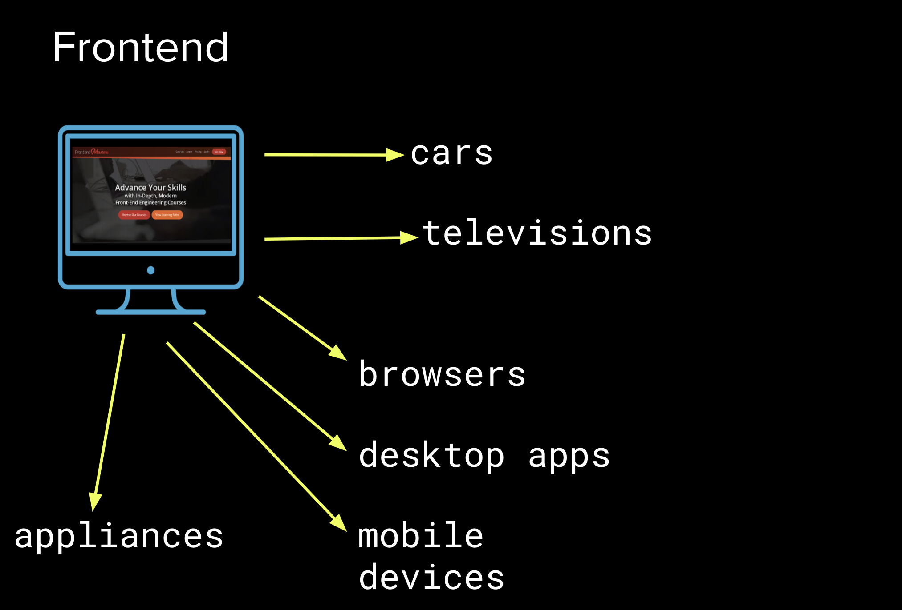
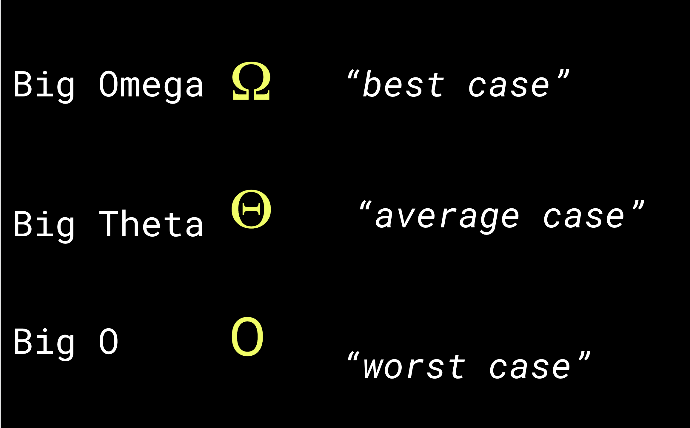
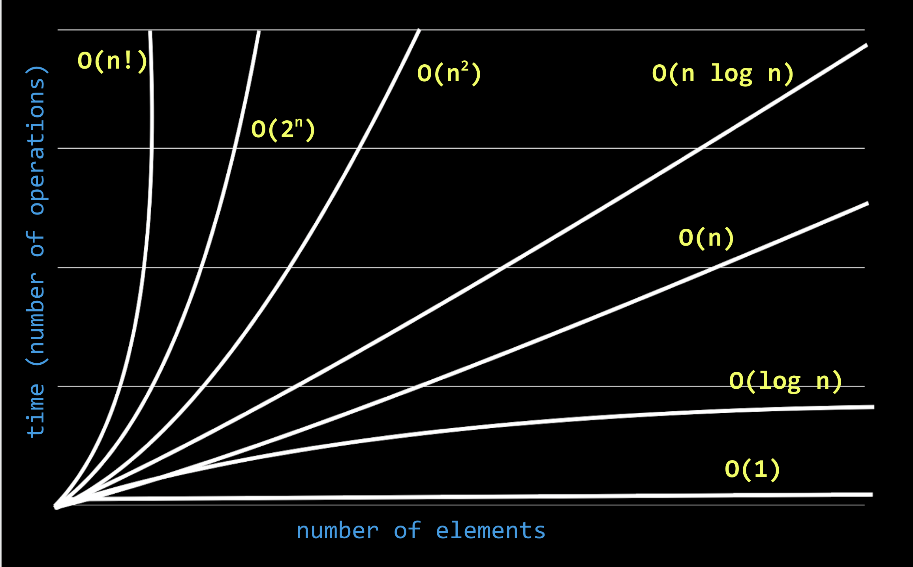
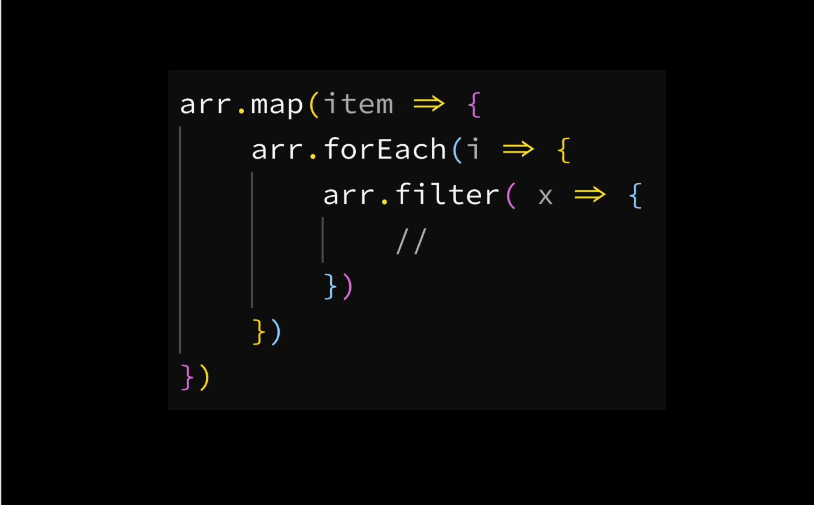
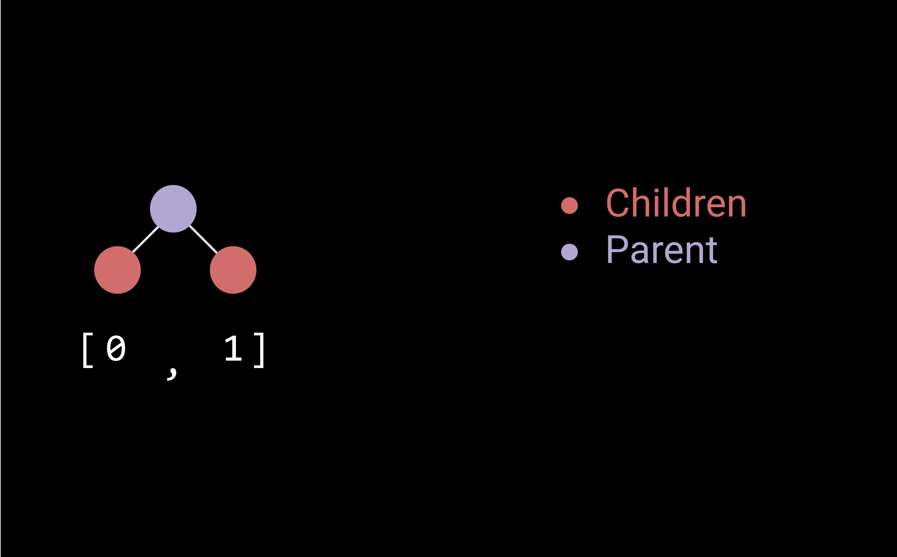
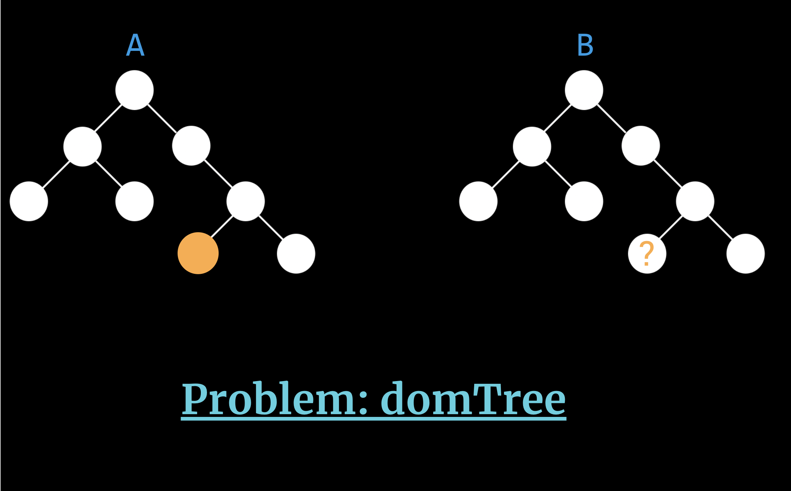

&nbsp;
<div align=center>
  
</div>
&nbsp;

<h1>Interviewing for Front-End Engineers</h1>

- [1. Introduction](#1-introduction)
  - [1.1. Why is Interviewing for Frontend So Difficult?](#11-why-is-interviewing-for-frontend-so-difficult)
  - [1.2. Application](#12-application)
  - [1.3. Before We Apply](#13-before-we-apply)
  - [1.4. The Resume](#14-the-resume)
  - [1.5. What if I Have No Experience?](#15-what-if-i-have-no-experience)
- [2. Initial Call](#2-initial-call)
  - [2.1. Preparing Interview Questions](#21-preparing-interview-questions)
- [3. **Pre-screen JavaScript Questions**](#3-pre-screen-javascript-questions)
- [4. Code Test](#4-code-test)
  - [4.1. Big-O](#41-big-o)
- [5. Phone Screen](#5-phone-screen)
  - [5.1. Phone Screen Exercise](#51-phone-screen-exercise)
- [6. On-Site](#6-on-site)
  - [6.1. Preparation](#61-preparation)
- [7. Questions](#7-questions)
  - [7.1. What is a string?](#71-what-is-a-string)
- [8. Reversing a string](#8-reversing-a-string)
  - [8.1. Arrays](#81-arrays)
  - [8.2. Removing Duplicate Strings Exercise](#82-removing-duplicate-strings-exercise)
  - [8.3. Flattening an Array Exercise](#83-flattening-an-array-exercise)
  - [8.4. Scope: Bind Exercise](#84-scope-bind-exercise)
  - [8.5. Timing: Debounce Exercise](#85-timing-debounce-exercise)
  - [8.6. Trees Exercise](#86-trees-exercise)
  - [8.7. Rendering Exercise](#87-rendering-exercise)
  - [8.8. Promises Exercise](#88-promises-exercise)

## 1. Introduction

Interviewing is hard. 

This blog post says there are three types of engineers: 

[3 tribes of programming](https://josephg.com/blog/3-tribes/)

1. Programming is math, all about algorithms and efficiency. 
2. Programming is for controlling hardware, low level bit flipping. How close to the metal do you understand.
3. Programming is for building things, the tinkerers, the builders, where most people sit.

Much of the disconnect between interviewing and the actual job is that we don't know what type of engineer we are, and the company doesn't know what type of engineer they want. 

### 1.1. Why is Interviewing for Frontend So Difficult?

Things move so fast and technologies change. 

The frontend could be so many things that is really hard to define it.



It is also so broad that it is difficult to know what to test interviewees on. 

We all have a different idea of what core principles are. For example, scope in JS is interpreted in different ways.

### 1.2. Application

The course the perspectives of both the candidate and the interviewer. 

We need to reframe failure, because we can always learn from our failures. 

We want to aim for a success rate of 0.501, that is out of every 2 interviews we succeed at 1.

If we can get to a point where we pass half of the interviews we attend, we are doing phenomenally. 

Currently the only people that are a 0.501 are the library creators and people who have changed the JavaScript landscape. 

As a community we should aim for everyone to have that success ratio by fixing the interview process. 

The steps of an interview. 

1. Application
2. Initial call
3. Code test
4. Phone screen
5. On-site
6. Result

Statistically speaking most of us will never get to the On-Site. That is the game of numbers. 

A lot of the big companies only hire 10% of applicants. 

### 1.3. Before We Apply

Think about what we like about our current job, and then think about what we want for our next role.

Most people don't give enough thought to this, and instead aimlessly go from company to company and never reach optimum satisfaction. 

Aim for somewhere that will help us grow and have job satisfaction. 

Ask ourselves which companies have appealing engineering cultures, and what makes it appealing. 

There is no point working for a company whose culture doesn't vibe with us. Even if the salary is amazing, if we won't be happy it isn't be a good fit. 

### 1.4. The Resume

- One page
- Skills
- Experience
- Technology familiarity
- Education
- Accomplishments

Spend time on the core requirements of what employers are looking for, rather than spending time making a fancy CV. 

Be straight to the point. They want to know accomplishments and that's it. 

Think about what would jump out if we had to look at 1000 CVs. 

Jem would literally send out something like the below.


### 1.5. What if I Have No Experience?

- Start at the company in a different role and move sideways.
- Start freelancing, charge low rates, build up to charging more.
- Open source contributions.
- Volunteer for NGO work.
- Put cool stuff on CodePen.
- Share what we do on Twitter.
- Be prepared to take low pay to start off.
- When we do get a job, leverage the people around us and learn as much as possible.
- Companies get 1000s of applications all the time, and if what we offer doesn't match the search criteria or algo, we get passed over.
- What we absolutely have to do is network.
- Go to conferences, talk to people, **network network network!**
- The absolute best way to get a job is through knowing someone.
- Hiring managers also say we need to have a LinkedIn profile.

## 2. Initial Call

**No mater what company we apply to it is guaranteed they will ask the following questions. We should be prepared to answer these right off the bat.** 

1. **What do you do currently?**
    Here they are looking to see what you are up to. 
    
2. **What are some projects you’ve worked on recently?**
    Here they are looking to find out whether you lean towards frontend or backend.
    Have the projects ready, what challenges we faced and how we overcame them. 
    
3. **What are you looking for in your next role?**
    Say something about working with people who are smarter than us so we can grow. 
    Or I want to solve hard problems. 
    Or I want to make an impact, and not be another cog on the wheel. 
    
4. **Why do you want to work for ______?**
    Look at the hiring company's website, understand what they do & what they are working on, and give a good reason. 
    
5. **What is your availability for the next steps?**
    If they ask this then they like you, and want to move you onto the next round. 
    Have the calendar open and advise a regular time when we are free. 
    
### 2.1. Preparing Interview Questions

**Candidate questions to be prepared for when interviewing someone.** 

1. **How many steps are in the interview process? How long does it generally take?**
2. **How big is your engineering team?**
3. **Which team would I be interviewing for?**
4. **What is the culture like?**
5. **Who are you competitors?**
6. **What sort of projects would I work on?**

## 3. **Pre-screen JavaScript Questions**

It is possible that we may get a set of questions on the initial call. Usually this is for the larger companies that want to vet us before they spend any more resources on us.

The company is not looking for precise answers, just that we have a broad knowledge.

- **What is the difference between const, let, and var?**
    You can't point a const to a different pointer. You can modify objects, properties on objects, array items. With let we can change the pointer, but it is only scoped to whatever the closure is. var is hoisted, so with let and const if you try to access them before they will throw a reference error, var will return undefined. 
    
- **Explain prototypical inheritance**
    Everything in JS has a prototype, a baseline object that it inherits from, and when we create a new object based on the prototype we can either inherit all the properties as default, or we can overwrite them with our own.
    
- **What is 'this' mean in JavaScript?**
    It is the global context of everything that is available to access, so all the objects and functions that are available that are not locally defined. 
    The scope that we are currently in, or the global window object.
    
- **What is the data structure of the DOM?**
    A tree.
    
- **What is a Stack and a Queue?**
    Data structures. a stack is LIFO, a queue is FIFO.
    
- **How would you create those data structures in JavaScript?**
    With an array. Pop, push & shift. 
    
- **How can you tell if an image element is loaded on a page?**
    Use the onLoad GlobalEventHandler.
    
- **What is call() and apply()?**
    Ways of changing the scope of the calling function. call is a series of arguments and apply is an array of arguments. 
    
- **What is event delegation and what are the performance tradeoffs?**
    Where we have one event listener on an ancestor which catches an event triggered on a descendant DOM node, and the event bubbles up to the listener. 
    
- **What is a Worker? When would you use one?**
    Something you would use in a browser to offload computationally expensive work to a different thread. Because JS is single threaded and we don't want to block the UI.

## 4. Code Test

Usually a 5-10 hour project to see how we code in a larger environment. 

Not all companies do this, but many do. 

If they give an amount of time to complete, double it.

Here are some tips: 

- Make your code as readable as possible
    - Comment your code
    - Don’t over complicate the architecture
- Don’t import too many libraries
- If you have time, add unit tests
- Ask questions!

Do not write clever code, just make it readable. 

Comments help the reader not have to think. 

If the code is too complicated the reader will just skip to the next applicant. 

The best code is the simplest code.

Stick to utility functions rather than importing a tonne of libraries. 

If something isn't relevant to our skillset or is super difficult, don't be afraid to politely decline and let them know why.

A code review checklist should be written when giving code tests. 

### 4.1. Big-O

A way to measure the longest amount of time any given function will take in the worst case scenario of input. 

There are actually three "bigs":



But generally we care about Big O because it is the worst possible outcome. 

When considering 1B items Big O becomes very important.



Anything from `n log n`  starts to become acceptable. 

Any time we are filtering over a dataset and every time we iterate we reduce the number of elements, that is going to be log time every time. 

O(n) is the baseline, and the most common case, where the worst case scenario is that we have to iterate over everything once. 

It is pretty hard to write something in constant time `O(1)` so what we should always strive for is `O(log n)` because it's fast. 

Counting loops is the way to verify the time complexity. Apply this to things that don't look like loops. For example, this is `O(n^3)`

To reduce complexity, reduce the loops. 



## 5. Phone Screen

A good chance to have an engineer talk to another engineer. 

The first chance to meet the kind of person you will be working with. 

Generally 30 mins - 1 hour of live coding. 

As the candidate: 

- Ask questions
- Talk out your solution
- Get comfortable with the environment

### 5.1. Phone Screen Exercise

[Frontend Interviewing code - test](https://codepen.io/jemyoung/pen/0817cc37159377752b6cd9bf70d40883?editors=1011)

- Jem says to use `document.createDocumentFrament()` to avoid overloading the DOM with renders for better perf.

## 6. On-Site

### 6.1. Preparation

If we do make it to the on-site stage, it is going to be challenging. 

If we get this far it is already an achievement, as most people don't. 

The company wants to hire us if we are invited on-site. They are looking for a reason not to hire use, so we need to not give them one!

Even if we completely bomb this stage, we have the opportunity to speak to some good engineers and learn from the experience.

Some tips: 

- Practice writing code without a computer
- Go over general sample problems
- Ask your friends to test you
- Try to ask what the style of technical questions will be
- Don't focus on the solutions, focus on how we get there

## 7. Questions

### 7.1. What is a string?

A primitive type but with methods. 

- `split()`
- `toLowerCase()`
- `subString()`
- `startsWith()`

They are immutable. 

Generally it is useful to turn a string into an array to manipulate it, then turn it back into a string. 

## 8. Reversing a string

```bash
function reverse(str) {
	return str.split('').reverse().join('');
}
```

### 8.1. Arrays

There are many ways to convert an item into an array.

- `Object.entries()`
- `Array.from()`
- `[...item]`

There are a lot of useful methods on arrays. What's important to know about array methods is which return a new array and which don't.

- `.isArray()`
- `.pop()`
- `.push()`
- `.filter()` - new array
- `.reduce()` - new anything we want!
- `.map()` - new array
- `.concat()` - new array
- `.join()`

### 8.2. Removing Duplicate Strings Exercise

A set is a data structure that cannot have duplicate items. 

```jsx
function removeDuplicates(str) {
	const arr = str.split(' ');

	const set = new Set(arr);
	const newStr = [...set].join(' ');

	return newStr;
}
```

### 8.3. Flattening an Array Exercise

Some problems lend themselves well to recursion. This is one of them. 

```jsx
// Without using .flat(), create a function to flatten an array
function flatten(arr) {
  arr.reduce((acc, item) => {
    if (Array.isArray(item)) {
      acc = acc.concat(flatten(item));
    } else {
      acc.push(item);
    }
    return acc;
  }. []);
}
```

### 8.4. Scope: Bind Exercise

The three ways we change scope are `call`, `apply` & `bind`.

```jsx
// Implement Function.prototype.bind()
/*
const foo = function () {
  console.log(this.bar);
};
let baz = foo.bind({ bar: 'hello' });
baz(); // Hello
*/
Function.prototype.bind = function (context) {
  const fn = this;

  return function () {
    fn.call(context);
  };
};

// Or if we just want to implement bind:
function bind(fn, context) {
  return function () {
    fn.call(context);
  };
}

// How would we deal with arguments?
function bind(fn, context) {
  return function () {
    fn.apply(context, [...arguments]);
  };
}
```

### 8.5. Timing: Debounce Exercise

Timing in JS is a popular question. We use `setInterval()` and `setTimeout()` for this.

Debounce is a way of slowing something down. Common in autocomplete operations. 

```jsx
// Implement debounce
function debounce(fn, time) {
  let setTimeoutId;

  return function () {
    if (setTimeoutId) {
      clearTimeout(setTimeoutId);
    }

    setTimeoutId = setTimeout(() => {
      fn.apply(this, arguments);
      setTimeoutId = null;
    }, time);
  };
}
// Throttle is a very similar concept
// throttle means to execute the first function call and not any subsequent ones until the time has expired.
function throttle(fn, time) {
  let setTimeoutId;

  return function () {
    if (setTimeoutId) {
      return; // only difference to debounce
    }

    setTimeoutId = setTimeout(() => {
      fn.apply(this, arguments);
      setTimeoutId = null;
    }, time);
  };
}
```

### 8.6. Trees Exercise

Fairly senior question. All trees have two properties, root & nodes in a parent / child relationship.

In terms of JS think of parent.child as an array of items.



Given two DOM trees how would be get the path if for instance.



```jsx
// We have two identical DOM trees, A and B. For DOM tree A, we have the location of an element.
// Create a function to find that same element in tree B.
function reversePath(element, root) {
  const path = [];
  let pointer = element;

  while (pointer.parent) {
    // conceptually this is the hardest part because we have to go up to look down to find out its position
    const index = pointer.parent.children.indexOf(pointer);
    path.push(index);

    pointer = pointer.parent;
  }
  // we've switched to the other tree at this point
  pointer = root;

  while (path.length) {
    pointer = children[path.pop()];
  }
}
```

### 8.7. Rendering Exercise

We move things all the time in CSS. In JS we just call those styles manually. 

To move something smoothly in CSS we use `transition`

To move something smoothly in JS we use `requestAnimationFrame()` which is a globally available function on the `Window` object. 

Every time there is a render `requestAnimationFrame()` is called. Since all browsers render at 60FPS, it will be called 60 times every second.

So if we put something in `requestAnimationFrame()` it will only update when the render happens, so it'll never block the UI. 

```jsx
// Create a function to move an element. The function arguments are,
// distance, duration, and the element to move.
function moveElement(duration, distance, element) {
  const start = performance.now();

  function move(currentTime) {
    const elapsed = currentTime - start;
    const progress = elapsed / duration;
    const amountToMove = progress * distance;

    element.style.transform = `translateX(${amountToMove}px)`;

    if (amountToMove < distance) {
      requestAnimationFrame(move);
    }
  }

  requestAnimationFrame(move);
}
```

### 8.8. Promises Exercise

A promise is a proxy for a value that's not necessarily known when the promise is created. 

A lot of older libraries especially in Node don't use async await, they use callbacks. So we still need to know how promises work to wrap a callback with a promise and return that.

```jsx
// Create a sleep function that takes one parameter (time) and
// will wait "time" ms
/*
async function run() {
  await sleep(500);
  console.log('hello');
  await sleep(500);
  console.log('world');
}
*/
function sleep(time) {
  return new Promise(resolve => {
    setTimeout(() => {
      resolve();
    }, time);
  });
}
```

This one is a lot more advanced. 

```jsx
// Create a function to turn any function into a "promisfied" function.
// Any function to be promisified will always have a callback as the last argument.
// The callback will always have this signature:
//   function(result){}

/*
    const exampleFn = function (x, y, callback) {};
    const promisedFn = promisify(exampleFn);
    promisedFn().then(...).then(...)
*/
function promisify(fn) {
  return function (...args) {
    return new Promise(function (resolve, reject) {
      function cb(result) {
        resolve(result);
      }

      fn.apply(this, args.concat(cb));
    });
  };
}

// Creating a custom setTimeout that takes callback at the end
function customSetTimeout(...args) {
  setTimeout(...args.reverse());
}
// Promisfy in action - using customSetTimeout
let setTimeOutPromise = promisify(customSetTimeout);

function printAndReturnPromise() {
  console.log('First Callback function called');
  return setTimeOutPromise(1000);
}

function printAfterGivenTime() {
  console.log('Second Callback function called');
}

// Promise chain
setTimeOutPromise(2000).then(printAndReturnPromise).then(printAfterGivenTime);
```